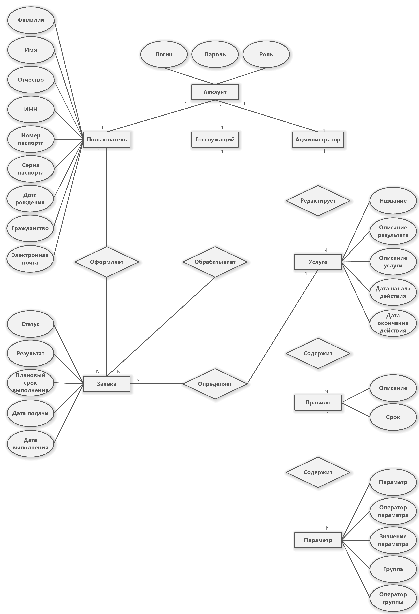

---
### Услуга
**Услуга** — сущность, содержащая все возможную информацию об услуге.

**Атрибуты**
- Название
- Описание услуги
- Описание результата — результат, который пользователь получит при выполнении услуги
- Дата планового оказания — примерная дата, к которой должна быть выполнена услуга

---
### Правило
**Правило** — сущность, определяющая временные ограничения, налагаемые на услугу.

**Атрибуты**: 
- Срок — время, в течении которого может быть выполнена услуга
- Значение — значение того, что правило проверяет (например, страна рождения или цель въезда)

---
### Заявка
**Заявка** — сущность, содержащая информацию на момент выполнения услуги.

**Атрибуты**:
- Статус — на рассмотрении / услуга оказана / отказано в услуге 
- Результат — описание результата выполненной услуги
- Ответственный — лицо, ответственное за выполнение услуги
- Инициатор — лицо (пользователь), который инициировал выполнение услуги 
- Дата подачи — дата, в которую пользователь подал заявку на услугу
- Дата выполнения — дата завершения работ над услугой

---
### Пользователь
**Пользователь** — сущность, определяющая физическое лицо, которое может быть администратором, госслужащим или обычный пользователем.

**Атрибуты**:
- Логин — уникальный набор символов, необходимый для идентификации в системе
- Пароль — набор символов, необходимый для аутентификации в системе 
- Роль — администратор / госслужащий / пользователь
- ФИО