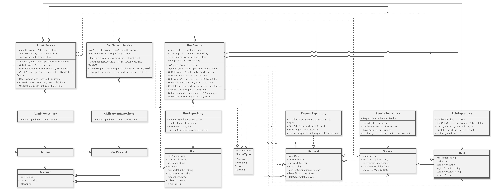

---
### AdminService
Содержит экземпляр объекта AdminRepository, ServiceRepository и RuleRepository
- TryLogIn — проверяет корректность логина и пароля и входит в существующий аккаунт
- GetAllServices — возвращает все услуги
- GetRulesForService — возвращает правила для конкретной услуги
- CreateService — создаёт услугу
- DeactivateService — делает услугу неактивной
- CreateRule — создаёт правило
- UpdateRule — обновляет правило
- DeleteRule — удаляет правило
### CivilServantService
Содержит экземпляр объекта CivilServantRepository и RequestRepository
- TryLogIn — проверяет корректность логина и пароля и входит в существующий аккаунт
- GetAllRequestsByStatus  — возвращает заявки по статусу
- AttachRequestResult — прикрепляет результат заявки
- ChangeRequestStatus —  изменяет статус заявки
### UserService
Содержит экземпляр объекта UserRepository, RequestRepository, ServiceRepository и RuleRepository
- SignUp — регистрирует новый аккаунт
- TryLogIn — проверяет корректность логина и пароля и входит в существующий аккаунт
- GetAllRequests — возвращает заявки
- GetAllActiveServices — возвращает активные (доступные) услуги
- GetRulesForService  — возвращает правила для конкретной услуги
- UpdateUser — обновляет данные пользователя
- CreateRequest — создаёт заявку
- CancelRequest — отменяет заявку
- GetRequestStatus — получает результат услуги
- GetRequestResult — получает статус услуги

---
### AdminRepository
- FindById — возвращает конкретного администратора
### CivilServantRepository
- FindById — возвращает конкретного госслужащего
### UserRepository
- FindById — возвращает конкретного пользователя
- Save — создаёт пользователя и возвращает назначенный идентификатор
- Update — обновляет информацию о пользователе
### ServiceRepository
- GetAll — возвращает все активные услуги
- FindById — возвращает конкретную услугу
- Save — создаёт услугу и возвращает назначенный идентификатор
- Update — обновляет услугу
### RuleRepository
- FindById — возвращает конкретное правило
- FindAllByService — возвращает все правила для конкретной услуги
- Save — создаёт правило и возвращает назначенный идентификатор
- Update — обновляет правило
- Delete — удаляет правило
### RequestRepository
- GetAll — возвращает все заявки
- FindById — возвращает конкретную заявку
- Save — создаёт заявку и возвращает назначенный идентификатор
- Update — обновляет заявку

---
### Account
- login — логин
- password — пароль
- role — роль (администратор / госслужащий / пользователь)
### Admin
### CivilServant
### User
- account — аккаунт пользователя
- firstName — имя
- patronymic — отчество
- lastName — фамилия
- inn — ИНН
- passportNumber — номер паспорта
- passportSeries — серия паспорта
- dateOfBirth — дата рождения
- citizenship — гражданство
- email — электронная почта
### Service
- name — название
- resultDescription — описание результата
- serviceDescription — описание услуги
- startDateOfValidity — дата, с которого услуга доступна
- endDateOfValidity  — дата, с которого услуга становится недоступна
- rules — набор правил
### Rule
- service — ссылка на услугу
- description — описание правила
- period — срок
- parameter — параметр
- logicalOperator — тип оператора
- parameterValue — значение параметра
### Request
- user — пользователь, подавший заявку
- service — услуга
- status — статус на текущий момент
- result — результат
- plannedCompletionDate — примерная дата выполнения
- dateOfSubmission — дата подачи
- dateOfCompletion — дата выполнения
