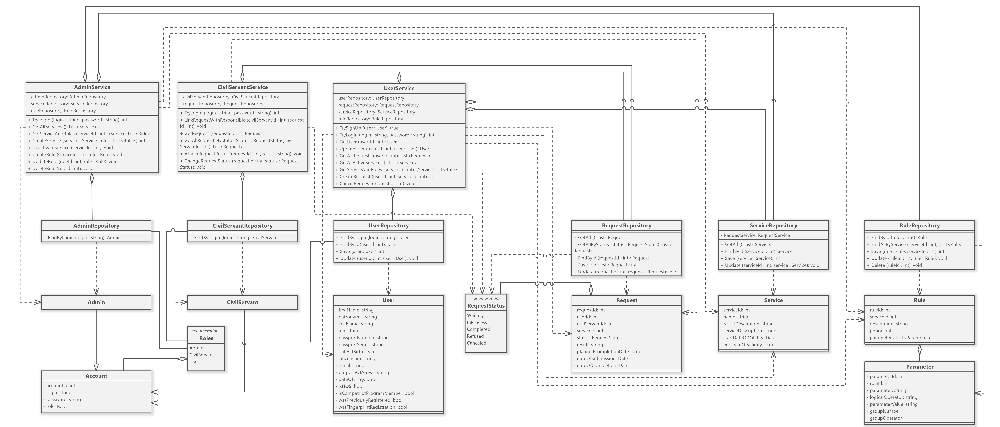

---
### AdminController
Содержит экземпляры объектов ServiceService и RuleService
- CreateService — создаёт новую услугу
- MakeServiceInactive — делает услугу неактивной (недействительной)
- AddRule — добавляет правило в услугу
- ExcludeRule — исключает (удаляет) правило из услуги
- UpdateRule — обновляет отредактированное правило услуги
### CivilServantController
Содержит экземпляры объектов RequestService и AccountService
- LogIn — входит в существующий аккаунт
- AddRequestResult — прикрепляет результат к конкретной заявке
- ChangeRequestStatus — изменяет статус конкретной заявки
### UserController
Содержит экземпляры объектов RequestService и AccountService
- SignUp — регистрирует новый аккаунт
- LogIn — вход в существующий аккаунт
- UpdateUser — обновляет информации о пользователе
- CreateRequest — создаёт заявку на услугу
- CancelRequest — отменяет заявку на услугу
- GetStatus — возвращает статус заявки
- GetResult — возвращает результат заявки
### ServiceController
Содержит экземпляры объектов ServiceService и RuleService
- GetAllServices — возвращает все активные услуги
- GetService — возвращает конкретную услугу
### RequestController
Содержит экземпляр объекта RequestService
- GetAllRequests — возвращает все заявки
- GetRequest — возвращает конкретную заявку

---
### AccountService
Содержит экземпляр объекта AccountRepository
- SignUp — регистрирует новый аккаунт
- LogIn — входит в существующий аккаунт
### UserService
Содержит экземпляр объекта UserRepository
- GetUser — возвращает информацию о пользователе 
- UpdateUser — обновляет информацию о пользователе
### ServiceService
Содержит экземпляр объекта ServiceRepository
- GetAllServices — возвращает все активные услуги
- GetService — возвращает конкретную услугу
- CreateService — создаёт услугу
- UpdateService — обновляет услугу
- DeactivateService — делает услугу неактивной
### RuleService
Содержит экземпляр объекта RuleRepository и ServiceRepository
- GetRule — возвращает правила для конкретной услуги
- CreateRule — создаёт правило
- UpdateRule — обновляет правило
- DeleteRule — удаляет правило
### RequestService
Содержит экземпляр объекта RequestRepository, UserRepository и ServiceRepository
- GetAllRequests — возвращает все заявки
- GetRequest — возвращает конкретную заявку
- CreateRequest — создаёт заявку
- UpdateRequest — обновляет заявку
- AttachResult — прикрепляет результат
- CalculatePlannedCompletionDate — вычисляет примерный срок выполнения

---
### AccountRepository
- FindByLoginAndPassword — возвращает конкретного пользователя
- Save — создаёт аккаунт
### UserRepository
- FindById — возвращает конкретного пользователя
- Save — создаёт пользователя
- Update — обновляет информацию о пользователе
### ServiceRepository
- GetAll — возвращает все активные услуги
- FindById — возвращает конкретную услугу
- Save — создаёт услугу
- Update — обновляет услугу
### RuleRepository
- FindById — возвращает конкретное правило
- Save — создаёт правило
- Update — обновляет правило
- Delete — удаляет правило
### RequestRepository
- GetAll — возвращает все заявки
- FindById — возвращает конкретную заявку
- Save — создаёт заявку
- Update — обновляет заявку

---
### Account
- login — логин
- password — пароль
- role — роль (администратор / госслужащий / пользователь)
### User
- account — аккаунт пользователя
- firstName — имя
- patronymic — отчество
- lastName — фамилия
- inn — ИНН
- passportNumber — номер паспорта
- passportSeries — серия паспорта
- dateOfBirth — дата рождения
- citizenship — гражданство
- email — электронная почта
### Service
- name — название
- resultDescription — описание результата
- serviceDescription — описание услуги
- startDateOfValidity — дата, с которого услуга доступна
- endDateOfValidity  — дата, с которого услуга становится недоступна
- rules — набор правил
### Rule
- service — ссылка на услугу
- description — описание правила
- period — срок
- parameter — параметр
- logicalOperator — тип оператора
- parameterValue — значение параметра
### Request
- user — пользователь, подавший заявку
- service — услуга
- status — статус на текущий момент
- result — результат
- plannedCompletionDate — примерная дата выполнения
- dateOfSubmission — дата подачи
- dateOfCompletion — дата выполнения
