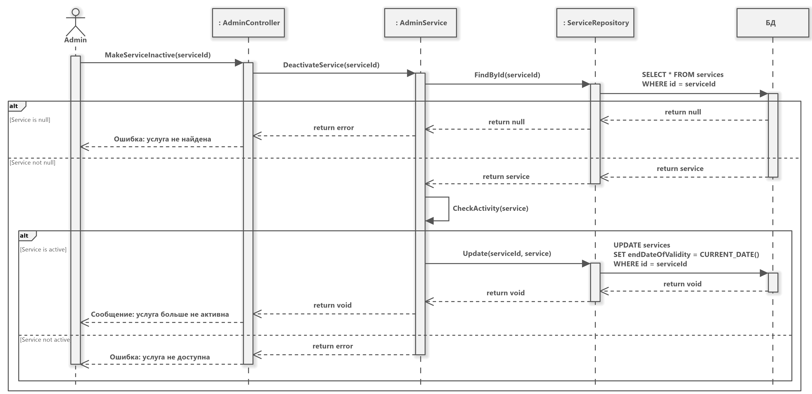
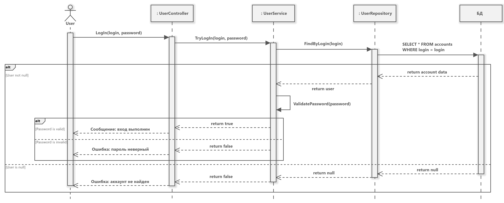
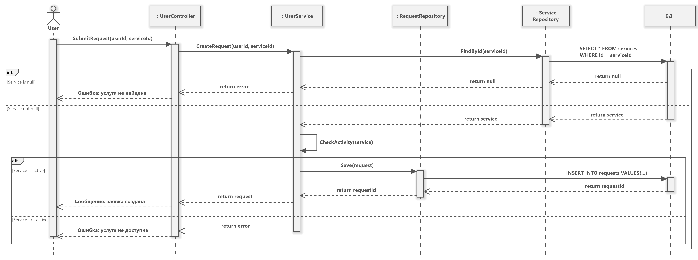

# Администратор 
### Войти в систему

**Основной сценарий:**
- Admin передаёт логин и пароль в AdminController.
- AdminController вызывает метод TryLogIn из AdminService, который вызывает метод FindByLogin из AdminRepository, проверяющий есть ли аккаунт с введёнными логином и паролем в БД.

**Альтернативные сценарии:**
- Админ существует (Admin not null):
	- БД через AdminRepository возвращает admin в AdminService.
	- AdminService валидирует пароль.
- Пароль валиден (Password is valid):
	- TryLogIn возвращает true.
	- AdminController выводит сообщение о удачном входе в аккаунт.
- Пароль не валиден (Password not valid):
	- TryLogIn возвращает false.
	- AdminController выводит сообщение о том, что неверный пароль.
- Админ не существует (Admin is null):
	- БД через AdminRepository возвращает null в AdminService.
	- TryLogIn возвращает false.
	- AdminController выводит ошибку о том, что аккаунт не найден.
### Добавить услугу

**Основной сценарий:**
- Admin создаёт услуги и прикрепляет правила, передавая это в качестве параметров AdminController.
- AdminController вызывает метод CreateService из AdminService, который:
	- Cохраняет услугу через метод Save из ServiceRepository в БД.
	- Возвращается идентификатор только что добавленной услуги.
	- Если список правил не пустой:
		- Возвращается список уже существующих правил.
		- Для каждого правила:
			- Проверяется, является ли добавляемое правило дубликатом в списке. Если нет:
				- Метод обращается к БД через FindAllByService, получая список существующих правил.
				- Добавляемое правило сохраняется в БД через метод Save из RuleRepository.
- CreateService из AdminService возвращает экземпляр созданной услуги, и AdminController оповещает о том, что услуга была добавлена.
### Сделать услугу недоступной

**Основной сценарий:**
- Admin делает какую-то услугу неактивной, передавая в AdminContoller идентификатор услуги.
- AdminContoller вызывает метод DeactivateService из AdminService, который проверяет, действительно ли существует такая услуга, вызывая FindById из ServiceRepository.
- ServiceRepository в свою очередь обращается к БД, та возвращает результат.

**Альтернативные сценарии:**
- Услуга не существует (Service is null):
	- БД возвращает пустое значение.
	- AdminService возвращает ошибку.
	- AdminController отображает ошибку, что услуга не существует.
- Услуга существует (Service not null): 
	- БД возвращает услугу.
	- AdminService проверяет, активна ли услуга.
- Услуга активна (Service is active):
	- AdminService обновляет через Update из ServiceRepository endDateOfValidity, устанавливая текущую дату, что равноценно прекращению действия услуги.
	- AdminController отображает сообщение, что услуга больше не активна.
- Услуга не активна (Service not active):
	- AdminController возвращает сообщение об ошибке, что услуга не доступна.
### Добавить правило

**Основной сценарий:**
- Admin добавляет правило, передавая идентификатор услуги и данные правила в AdminController.
- AdminController вызывает CreateRule, который проверяет через FindById из RuleRepository, существует ли услуга с таким идентификатором.
- RuleRepository связывается с БД, та возвращает результат.

**Альтернативные сценарии:**
- Услуга не существует (Service is null):
	- БД возвращает пустое значение.
	- AdminService возвращает ошибку.
	- AdminController возвращает сообщение об ошибке, что услуга не найдена.
- Услуга существует (Service not null):
	- БД возвращает услугу.
	- AdminService проверяет, активна ли услуга.
- Услуга активна (Service is active):
	- AdminService запрашивает список всех правил услуги через FindAllByService из RuleRepository.
	- БД возвращает список правил.
	- AdminService проверяет rule на дубликат, используя полученные rules.
- Услуга не активна (Service not active):
	- AdminController возвращает сообщение об ошибке, что услуга не доступна. 
- Правила услуги содержат добавляемое правило (Rules contain added rule):
	- AdminController возвращает ошибку, что такое правило уже существует.
- Правила услуги не содержат добавляемое правило (Rules not contain added rule):
	- Происходит сохранение правила методом Save через RuleRepository.
	- RuleRepository отправляет запрос к БД, сохраняет правило.
	- AdminController возвращает сообщение, что правило добавлено.
### Редактировать правило

**Основной сценарий:**
- Admin редактирует правило, передавая в AdminController идентификатор правили и изменения.
- AdminController вызывает UpdateRule из AdminService, который проверяет существует ли такое правило, вызывая FindById из RuleRepository.
- RuleRepository обращается к БД, та возвращает результат.

**Альтернативные сценарии:**
- Правило не существует (Rule is null):
	- БД возвращает пустое значение.
	- AdminService возвращает ошибку.
	- AdminController возвращает сообщение об ошибке, что правило не найдено.
- Правило существует (Rule not null):
	- AdminService вызывает Update из RuleRepository.
	- RuleRepository обращается к БД, вносит изменения.
	- AdminController возвращает сообщение, что правило обновлено.
### Удалить правило

**Основной сценарий:**
- Admin удаляет правило, сообщая AdminController идентификатор правила.
- AdminController вызывает DeleteRule из AdminService, который проверяет, действительно ли существует такое правило, вызывая FindById из RuleRepository.
- RuleRepository делает запрос к БД, та возвращает результат.

**Альтернативные сценарии:**
- Правило не существует (Rule is null):
	- БД возвращает пустое значение.
	- AdminService возвращает ошибку.
	- AdminController возвращает сообщение об ошибке, что правило не найдено.
- Правило существует (Rule not null):
	- AdminService вызывает Delete из RuleRepository.
	- RuleRepository обращается к БД, удаляет правило.
	- AdminController возвращает сообщение, что правило удалено.

---
# Госслужащий
### Войти в систему

**Основной сценарий:**
- CivilServant передаёт логин и пароль в CivilServantController.
- CivilServantController вызывает метод TryLogIn из CivilServantService, который вызывает метод FindByLogin из CivilServantRepository, проверяющий есть ли аккаунт с введёнными логином и паролем в БД.

**Альтернативные сценарии:**
- Госслужащий существует (CivilServant not null):
	- БД через AdminRepository возвращает civilServant в CivilServantService.
	- CivilServantService валидирует пароль.
- Пароль валиден (Password is valid):
	- TryLogIn возвращает true.
	- CivilServantController выводит сообщение о удачном входе в аккаунт.
- Пароль не валиден (Password not valid):
	- TryLogIn возвращает false.
	- CivilServantController выводит сообщение о том, что неверный пароль.
- Госслужащий не существует (CivilServant is null):
	- БД через AdminRepository возвращает null в CivilServantService.
	- TryLogIn возвращает false.
	- CivilServantController выводит ошибку о том, что аккаунт не найден.
### Просмотреть заявку

**Основной сценарий:**
- CivilServant получает заявки с отбором по статусу, передавая CivilServantController необходимый статус.
- CivilServantController вызывает GetAllRequestsByStatus из CivilServantService.
	- CivilServantController вызывает метод GetAll из RequestRepository.
	- RequestRepository делает запрос к БД, та возвращает все заявки.
- CivilServantService отбирает и возвращает только заявки, которые соответствуют изначально указанному статусу.
- CivilServantController выводит список заявок с заданным статусом.
### Изменить статус услуги

**Основной сценарий:**
- CivilServant изменяет статус заявки, передавая CivilServantController идентификатор заявки и новый статус.
- CivilServantController вызывает ChangeRequestStatus из CivilServantService, который проверяет, есть ли заявка с таким идентификатором, вызывая FindById из RequestRepository.
- RequestRepository делает запрос к БД, та возвращает результат.

**Альтернативные сценарии:**
- Заявка не существует (Request is null):
	- БД возвращает пустое значение.
	- CivilServantService возвращает ошибку.
	- CivilServantController возвращает сообщение об ошибке, что заявка не найдена.
- Заявка существует (Request not null):
	- БД возвращает заявку.
- Статус в состоянии «В процессе» (status is «InProcess»):
	- CivilServantService вызывает Update из RequestRepository.
	- RequestRepository обращается к БД, вносит изменения.
	- CivilServantController возвращает сообщение, что статус заявки обновлён.
- Статус в ином состоянии (else):
	- CivilServantService возвращает ошибку.
	- CivilServantController возвращает сообщение об ошибке, что запрещено изменять статус заявки.
### Добавить результат услуги

**Основной сценарий:**
- CivilServant прикрепляет результат к заявке, передавая в CivilServantController идентификатор заявки и результат.
- CivilServantController вызывает AttachRequestResult из CivilServantService, который проверяет, действительно ли существует заявка с указанным идентификатором, вызывая FindById из RequestRepository.
- RequestRepository делает запрос к БД, та возвращает результат.

**Альтернативные сценарии:**
- Заявка не существует (Request is null):
	- БД возвращает пустое значение.
	- CivilServantService возвращает ошибку.
	- CivilServantController возвращает сообщение об ошибке, что заявка не найдена.
- Заявка существует (Request not null):
	- БД возвращает заявку.
- Статус в состоянии «Завершено» (status is «Completed»):
	- CivilServantService вызывает Update из RequestRepository.
	- RequestRepository обращается к БД, вносит изменения.
	- CivilServantController возвращает сообщение, что статус заявки обновлён.
- Статус в ином состоянии (else):
	- CivilServantService возвращает ошибку.
	- CivilServantController возвращает сообщение об ошибке, что запрещено изменять статус заявки.

---
# Пользователь

### Зарегистрироваться

**Основной сценарий:**
- User регистрируется в системе, передавая UserController логин и пароль.
- UserController вызывает TrySignUp из UserService, который проверяет, есть ли уже такие логин, вызывая FindByLoginAndPassword из UserRepository.
- UserRepository делает запрос к БД, та возвращает результат.

**Альтернативные сценарии:**
- Пользователь существует / логин занят (User not null):
	- БД через UserRepository возвращает user в UserService.
	- UserService возвращает false.
	- UserController возвращает сообщение об ошибке, что пользователь с таким логином уже существует.
- Пользователь не существует / логин свободен (User is null):
	- БД через UserRepository возвращает null в UserService.
	- UserService вызывает Save из UserRepository.
	- UserRepository обращается к БД, сохраняя нового пользователя.
	- UserService возвращает true.
	- UserController возвращает сообщение, что аккаунт зарегистрирован.
### Войти в систему

**Основной сценарий:**
- User передаёт логин и пароль в UserController.
- UserController вызывает метод TryLogIn из UserService, который вызывает метод FindByLogin из UserRepository, проверяющий есть ли аккаунт с введёнными логином и паролем в БД.

**Альтернативные сценарии:**
- Пользователь существует (User not null):
	- БД через UserRepository возвращает user в UserService.
	- UserService валидирует пароль.
- Пароль валиден (Password is valid):
	- TryLogIn возвращает true.
	- UserController выводит сообщение о удачном входе в аккаунт.
- Пароль не валиден (Password not valid):
	- TryLogIn возвращает false.
	- UserController выводит сообщение о том, что неверный пароль.
- Пользователь не существует (User is null):
	- БД через UserRepository возвращает null в UserService.
	- TryLogIn возвращает false.
	- UserController выводит ошибку о том, что аккаунт не найден.
### Изменить данные учётной записи

**Основной сценарий:**
- User изменяет данные учётной записи, передавая в UserController идентификатор пользователя и данные.
- UserController вызывает UpdateUser из UserService, который проверяет есть ли пользователь с таким идентификатором, вызывая FindById из UserRepository.
- UserRepository обращается к БД, та возвращает результат.

**Альтернативные сценарии:**
- Пользователь не существует (User is null):
	- БД возвращает пустое значение.
	- UserService возвращает ошибку.
	- UserController возвращает сообщение об ошибке, что пользователя не существует.
- Пользователь существует (User not null):
	- БД возвращает пользователя.
	- UserService вызывает Update из UserRepository.
	- UserRepository обращается к БД, вносит изменения.
	- UserController возвращает сообщение, что данные обновлены.
### Подать заявку на услугу

**Основной сценарий:**
- User подаёт заявку, передавая UserController идентификаторы пользователя и услуги.
- UserController вызывает CreateRequest из UserService, который проверяет, вызывая FindById из ServiceRepository, существует ли такая услуга.
- ServiceRepository делает запрос к БД, та возвращает результат.

**Альтернативные сценарии:**
- Услуга не существует (Service is null):
	- БД возвращает пустое значение.
	- UserService возвращает ошибку.
	- UserController возвращает сообщение об ошибке, что услуга не найдена.
- Услуга существует (Service not null):
	- БД возвращает услугу.
	- UserService проверяет, активна ли услуга.
- Услуга активна (Service is active):
	- UserService вызывает Save из UserRepository.
	- UserRepository обращается к БД, сохраняет заявку.
	- UserController возвращает сообщение, что заявка создана.
- Услуга не активна (Service not active):
	- UserController возвращает сообщение об ошибке, что услуга не доступна.
### Отследить статус заявки

**Основной сценарий:**
- User получает статус заявки, передавая UserController идентификатор заявки.
- UserController вызывает GetRequestStatus из UserService, который в свою очередь вызывает FindById из RequestRepository, и далее возвращается результат запроса к БД.

**Альтернативные сценарии:**
- Заявка не существует (Request is null):
	- БД возвращает пустое значение.
	- UserService возвращает ошибку.
	- UserController возвращает сообщение об ошибке, что заявка не найдена.
- Заявка существует (Request not null):
	- БД возвращает заявку.
	- UserService возвращается её статус.
	- UserController выводит статус заявки.
### Получить результат услуги

**Основной сценарий:**
- User получает статус заявки, передавая UserController идентификатор заявки.
- UserController вызывает GetRequestResult из UserService, который в свою очередь вызывает FindById из RequestRepository, и далее возвращается результат запроса к БД.

**Альтернативные сценарии:**
- Заявка не существует (Request is null):
	- БД возвращает пустое значение.
	- UserService возвращает ошибку.
	- UserController возвращает сообщение об ошибке, что заявка не найдена.
- Заявка существует (Request not null):
	- БД возвращает заявку.
	- UserService возвращается её результат.
	- UserController выводит результат заявки.
### Отменить заявку

**Основной сценарий:**
- User отменяет заявку, передавая в UserController её идентификатор.
- UserController вызывает CancelRequest из UserService, который проверяет, существует ли заявка с таким идентификатором, вызывая FindById из RequestRepository.
- RequestRepository делает запрос к БД, та возвращает результат.

**Альтернативные сценарии:**
- Заявка не существует (Request is null):
	- БД возвращает пустое значение.
	- UserService возвращает ошибку.
	- UserController возвращает сообщение об ошибке, что заявка не найдена.
- Заявка существует (Request not null):
	- БД возвращает заявку.
- Статус в состоянии «В процессе» (status is «InProcess»):
	- UserService вызывает Update из RequestRepository.
	- RequestRepository обращается к БД, вносит изменения.
	- UserController возвращает сообщение, что заявка отменена.
- Статус в ином состоянии (else):
	- UserService возвращает ошибку.
	- UserController возвращает сообщение об ошибке, что невозможно отменить заявку.