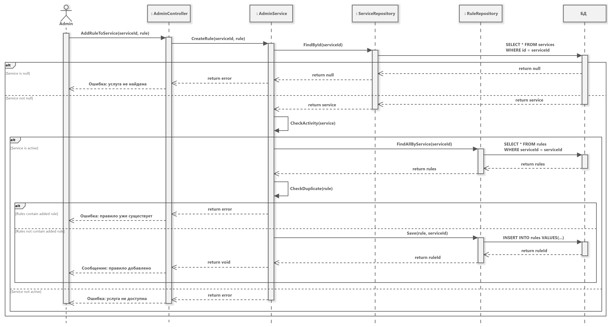
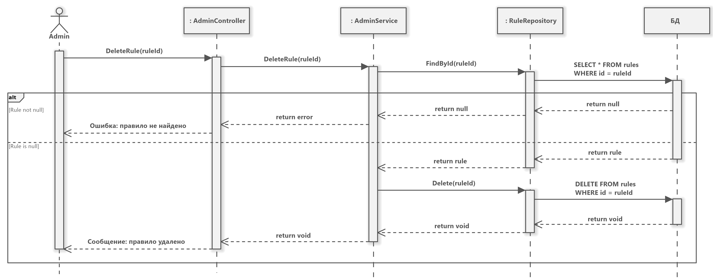
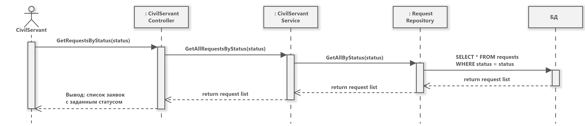
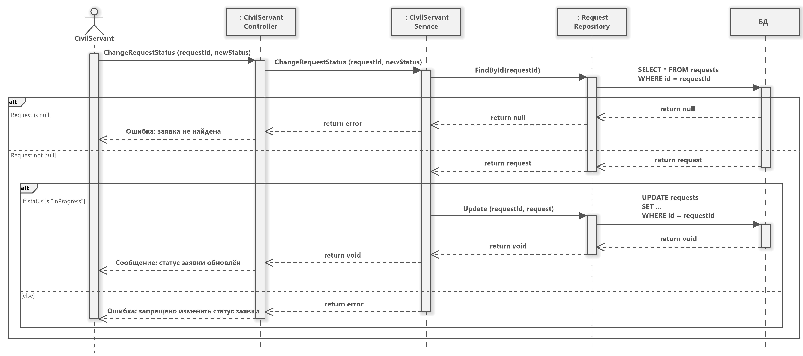

# Администратор 
### Войти в систему

1. Admin передаёт логин и пароль в AdminController.
2. AdminController вызывает метод TryLogIn из AdminService, который:
	1. Вызывает метод FindByLoginAndPassword из AdminRepository, проверяющий есть ли аккаунт с введёнными логином и паролем в БД.
	2. БД через AdminRepository возвращает результат в AdminService.
3. AdminService (в зависимости от результата):
	1. Если аккаунт с ролью admin существует, то TryLogIn возвращает true, и AdminController выводит сообщение о удачном входе в аккаунт.
	2. Иначе, если аккаунт не существует, TryLogIn возвращает false, и AdminController выводит сообщение о том, что аккаунта с таким логином и паролем не существует.
### Добавить услугу

1. Admin создаёт услуги и прикрепляет правила, передавая это в качестве параметров AdminController.
2. AdminController вызывает метод CreateService из AdminService, который:
	1. Происходит сохранение услугу через метод Save из ServiceRepository в БД.
	2. Возвращается идентификатор только что добавленной услуги.
	3. Если список правил не пустой, то каждое правило сохраняется в БД через метод Save из RuleRepository.
3. CreateService из AdminService возвращает экземпляр созданной услуги и AdminController оповещает о том, что услуга была добавлена.
### Сделать услугу недоступной

1. Admin делает какую-то услугу неактивной, передавая в AdminContoller идентификатор услуги.
2. AdminContoller вызывает метод DeactivateService из AdminService, который:
	1. Проверяет, действительно ли существует такая услуга, вызывая FindById из ServiceRepository.
	2. ServiceRepository в свою очередь обращается к БД, та возвращает результат.
3. AdminService (в зависимости от результата):
	1. Если услуга существует, то: 
		1. AdminService обновляет через ServiceRepository endDateOfValidity, устанавливая текущую дату, что равноценно прекращению действия услуги.
		2. AdminController отображает сообщение, что услуга больше не активна.
	2. Если услуга не существует, то AdminController отображает ошибку, что услуга не существует
### Добавить правило

1. Admin добавляет правило, передавая идентификатор услуги и данные правила в AdminController.
2. AdminController вызывает CreateRule, который:
	1. Проверяет через FindById из RuleRepository, существует ли услуга с таким идентификатором.
	2. RuleRepository связывает с БД, та возвращает результат.
3. AdminService (в зависимости от результата):
	1. Если услуга существует, то:
		1. Происходит сохранение правила методом Save через RuleRepository.
		2. RuleRepository отправляет запрос к БД.
		3. AdminController возвращает сообщение, что правило добавлено.
	2. Если услуга не существует, AdminController возвращает сообщение об ошибке, что услуга не найдена.
### Редактировать правило

1. Admin редактирует правило, передавая в AdminController идентификатор правили и изменения.
2. AdminController вызывает UpdateRule из AdminService, который:
	1. Проверяет существует ли такое правило, вызывая FindById из RuleRepository.
	2. RuleRepository обращается к БД, та возвращает результат.
3. AdminService (в зависимости от результата):
	1. Если правило существует, то:
		1. AdminService вызывает Update из RuleRepository.
		2. RuleRepository обращается к БД, вносит изменения.
		3. AdminController возвращает сообщение, что правило обновлено.
	2. Если правило не существует, AdminController возвращает сообщение об ошибке, что правило не найдено.
### Удалить правило

1. Admin удаляет правило, сообщая AdminController идентификатор правила.
2. AdminController вызывает DeleteRule из AdminService, который:
	1. AdminService проверяет, действительно ли существует такое правило, вызывая FindById из RuleRepository.
	2. RuleRepository делает запрос к БД, та возвращает результат.
3. AdminService (в зависимости от результата):
	1. Если правило существует, то:
		1. AdminService вызывает Delete из RuleRepository.
		2. RuleRepository обращается к БД, удаляет правило.
		3. AdminController возвращает сообщение, что правило удалено.
	2. Если правило не существует, AdminController возвращает сообщение об ошибке, что правило не найдено.

---
# Госслужащий
### Войти в систему

1. CivilServant хочет войти в систему, передавая CivilServantController логин и пароль.
2. CivilServantController вызывает метод TryLogIn из CivilServantService, который:
	1. Вызывает метод FindByLoginAndPassword из CivilServantRepository, проверяющий есть ли аккаунт с введёнными логином и паролем в БД.
	2. БД через CivilServantRepository возвращает результат в CivilServantService.
3. CivilServantService (в зависимости от результата):
	1. Если аккаунт с ролью civilservant существует, то TryLogIn возвращает true, и CivilServantController выводит сообщение о удачном входе в аккаунт.
	2. Иначе, если аккаунт не существует, TryLogIn возвращает false, и CivilServantController выводит сообщение о том, что аккаунта с таким логином и паролем не существует.
### Просмотреть заявку

1. CivilServant получает заявки с отбором по статусу, передавая CivilServantController необходимый статус.
2. CivilServantController вызывает GetAllRequestsByStatus из CivilServantService.
	1. CivilServantController вызывает метод GetAll из RequestRepository.
	2. RequestRepository делает запрос к БД, та возвращает все заявки.
3. CivilServantService отбирает и возвращает только заявки, которые соответствуют изначально указанному статусу.
4. CivilServantController выводит список заявок с заданным статусом.
### Изменить статус услуги

1. CivilServant изменяет статус заявки, передавая CivilServantController идентификатор заявки и новый статус.
2. CivilServantController вызывает ChangeRequestStatus из CivilServantService, который:
	1.  Проверяет, есть ли заявка с таким идентификатором, вызывая FindById из RequestRepository.
	2. RequestRepository делает запрос к БД, та возвращает результат.
3. CivilServantService (в зависимости от результата):
	1. Если заявка существует, то:
		1. CivilServantService вызывает Update из RequestRepository.
		2. RequestRepository обращается к БД, вносит изменения.
		3. CivilServantController возвращает сообщение, что статус заявки обновлён.
	2. Если заявки не существует, CivilServantController возвращает сообщение об ошибке, что заявка не найдена.
### Добавить результат услуги

1. CivilServant прикрепляет результат к заявке, передавая в CivilServantController идентификатор заявки и результат.
2. CivilServantController вызывает AttachRequestResult из CivilServantService, который:
	1. Проверяет, действительно ли существует заявка с указанным идентификатором, вызывая FindById из RequestRepository.
	2. RequestRepository делает запрос к БД, та возвращает результат.
3. CivilServantService (в зависимости от результата):
	1. Если заявка существует, то:
		1. CivilServantService вызывает Update из RequestRepository.
		2. RequestRepository обращается к БД, вносит изменения.
		3. CivilServantController возвращает сообщение, что статус заявки обновлён.
	2. Если заявки не существует, CivilServantController возвращает сообщение об ошибке, что заявка не найдена.
---
# Пользователь

### Зарегистрироваться

1. User регистрируется в системе, передавая UserController логин и пароль.
2. UserController вызывает TrySignUp из UserService, который:
	1. Вызывает FindByLoginAndPassword из UserRepository, проверяя, есть ли уже такие логин и пароль.
	2. UserRepository делает запрос к БД, та возвращает результат.
3. UserService (в зависимости от результата):
	1. Если такого пользователя *не* существует, то:
		1. UserService вызывает Save из UserRepository.
		2. UserRepository обращается к БД, сохраняя нового пользователя.
		3. UserService возвращает true, и UserController возвращает сообщение, что аккаунт зарегистрирован.
	2. Если пользователя уже существует, UserService возвращает false, и UserController возвращает сообщение об ошибке, что пользователь с таким логином и паролем существует.
### Войти в систему

1. User хочет войти в систему, передавая UserController логин и пароль.
2. UserController вызывает метод TryLogIn из UserService, который:
	1. Вызывает метод FindByLoginAndPassword из UserRepository, проверяющий есть ли аккаунт с введёнными логином и паролем в БД.
	2. БД через UserRepository возвращает результат в UserService.
3. UserService (в зависимости от результата):
	1. Если аккаунт с ролью user существует, то TryLogIn возвращает true, и UserController выводит сообщение о удачном входе в аккаунт.
	2. Иначе, если аккаунт не существует, TryLogIn возвращает false, и UserController выводит сообщение о том, что аккаунта с таким логином и паролем не существует.
### Изменить данные учётной записи

1. User изменяет данные учётной записи, передавая в UserController идентификатор пользователя и данные.
2. UserController вызывает UpdateUser из UserService, который:
	1. Вызывает FindById из UserRepository, проверяющий есть ли пользователь с таким идентификатором.
	2. UserRepository обращается к БД, та возвращает результат.
3. UserService (в зависимости от результата):
	1. Если пользователь существует, то:
		1. UserService вызывает Update из UserRepository.
		2. UserRepository обращается к БД, вносит изменения.
		3. UserController возвращает сообщение, что данные обновлены.
	2. Если пользователя не существует, UserController возвращает сообщение об ошибке, что пользователя не существует.
### Подать заявку на услугу

1. User подаёт заявку, передавая UserController идентификаторы пользователя и услуги.
2. UserController вызывает CreateRequest из UserService, который:
	1. Проверяет, вызывая FindById из ServiceRepository, существует ли такая услуга.
	2. ServiceRepository делает запрос к БД, та возвращает результат.
3. UserService (в зависимости от результата):
	1. Если услуга существует, то:
		1. UserService вызывает Save из UserRepository.
		2. UserRepository обращается к БД, сохраняет заявку.
		3. UserController возвращает сообщение, что заявка создана.
	2. Если услуги не существует, UserController возвращает сообщение об ошибке, что услуги не существует.
### Отследить статус заявки

1. User получает статус заявки, передавая UserController идентификатор заявки.
2. UserController вызывает GetRequestStatus из UserService, который в свою очередь вызывает FindById из RequestRepository, и далее возвращается результат запроса к БД.
3. UserService (в зависимости от результата):
	1. Если заявка существует, то возвращается её статус.
	2. Если заявки не существует, возвращается ошибка, что заявки не существует.
### Получить результат услуги

1. User получает результат заявки, передавая UserController идентификатор заявки.
2. UserController вызывает GetRequestResult из UserService, который в свою очередь вызывает FindById из RequestRepository, и далее возвращается результат запроса к БД.
3. UserService (в зависимости от результата):
	1. Если заявка существует, то возвращается её результат.
	2. Если заявки не существует, возвращается ошибка, что заявки не существует.
### Отменить заявку

1. User отменяет заявку, передавая в UserController её идентификатор.
2. UserController вызывает CancelRequest из UserService, который:
	1. Проверяет, существует ли заявка с таким идентификатором, вызывая FindById из RequestRepository.
	2. RequestRepository делает запрос к БД, та возвращает результат.
3. UserService (в зависимости от результата):
	1. Если заявка существует, то:
		1. UserService вызывает Update из UserRepository.
		2. UserRepository обращается к БД, вносит изменения (изменяет статус заявки).
		3. UserController возвращает сообщение, что заявка отменена.
	2. Если заявки не существует, UserController возвращает сообщение об ошибке, что заявки не существует.