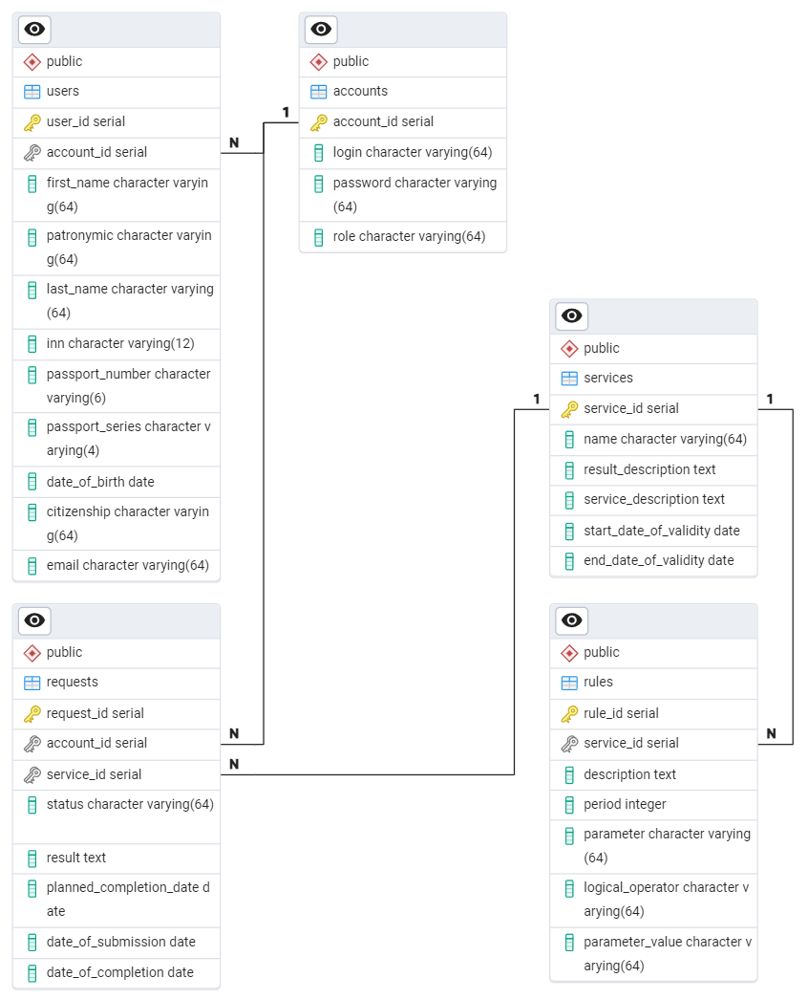

---
### Таблица accounts
Хранит данные аккаунта для авторизации участников системы.
- account_id — идентификатор аккаунта  
- login — логин
- password — пароль
- role — роль (администратор / госслужащий / пользователь)
---
### Таблица users
Хранит данные о пользователях.
- user_id — идентификатор пользователя
- account_id — идентификатор аккаунта пользователя (ссылка)
- first_name — имя
- patronymic — отчество
- last_name — фамилия
- inn — ИНН
- passport_number — номер паспорта
- passport_series — серия паспорта
- date_of_birth — дата рождения
- citizenship — гражданство
- email — электронная почта

---
### Таблица services
Хранит данные об услугах.

- service_id — идентификатор услуги
- name — название
- result_description — описание  результата
- service_description — описание услуги
- start_date_of_validity — дата начала действия
- end_date_of_validity — дата окончания действия

---
### Таблица rules
Хранит данные об правилах.

- rule_id — идентификатор правила
- service_id — идентификатор услуги (ссылка)
- description — описание
- period — период / срок
- parameter — параметр
- logical_operator — логический оператор
- parameter_value — значение параметра

---
### Таблица request
Хранит данные о заявках.

- request_id — идентификатор заявки
- account_id — идентификатор аккаунта (ссылка)
- service_id — идентификатор услуги (ссылка)
- status — статус заявки («InProcess» / «Completed» / «Refused» / «Canceled»)
- result — результат
- planned_completion_date — плановый срок выполнения 
- date_of_submission — дата подачи
- date_of_completion — дата выполнения