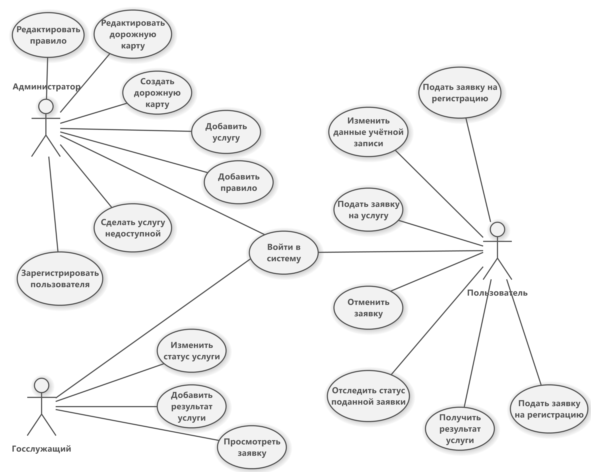

---
### Акторы / Роли / Права доступа
1. Администратор — специалист, управляющий настройками системы и параметрами предоставляемых услуг.
2. Госслужащий — сотрудник государственного органа, обрабатывающий заявки пользователей и предоставляющий результаты услуг.
3. Пользователь — физическое лицо, которое подаёт заявки и получает государственные услуги через систему.

---

### Администратор
- Войти в систему: идентификация → аутентификация → авторизация
- Создать дорожную карту: создаёт набор услуг, указывая к ним правила, описание и прочие элементы.
- Редактировать дорожную карту: изменяет описание, структуру и другие элементы.
- Добавить услугу: добавляет новую услугу в дорожную карту, указывая список правил.
- Редактировать список правил услуги: изменяет список правил для получения услуги.
- Сделать услугу недоступной: помечает услугу как неактивная, помещая её в архив.

***Удаление или редактирование** услуг запрещено, они хранятся, условно, в архиве. Если некоторые данные (исключая правила) в услуге изменились, необходимо пересоздать услугу, а старую поместить в архив.*

---

### Госслужащий
- Войти в систему: идентификация → аутентификация → авторизация
- Просмотреть заявку: просматривает заявку из списка заявок.
- Изменить статус услуги:
	- На рассмотрении — начальный этап, когда заявка подана и находится в процессе обработки.
	- Услуга оказана — финальный этап, когда услуга завершена, и принято решение или результат предоставлен.
	- Отказано в услуге — ситуация, когда в предоставлении услуги отказано, например, из-за несоответствия требованиям.
- Добавить результат услуги: может передать результат обработанной услуги в форме текста.

---

### Пользователь
- Зарегистрироваться в системе: создаёт учётную запись и проходит авторизацию.
- Войти в систему: идентификация → аутентификация → авторизация
- Изменить данные учётной записи: может добавлять/изменять данные учётной записи
- Подать заявку на услугу: выбирает услугу из доступного списка по его введённым данным и отправляет заявку.
- Отследить статус заявки: может просматривать текущий статус своих заявок (на рассмотрении, услуга оказана, отказано в услуге).
- Получить результат услуги: если услуга оказана, пользователь может посмотреть результат, переданный госслужащим.
- Отменить заявку: может отозвать свою заявку, если она ещё находится в статусе «на рассмотрении».
